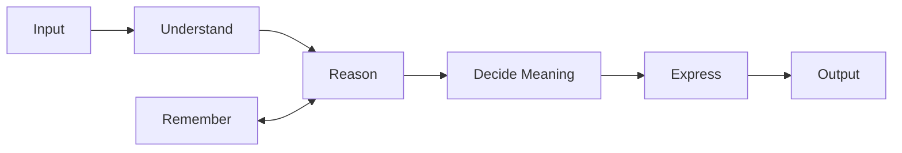
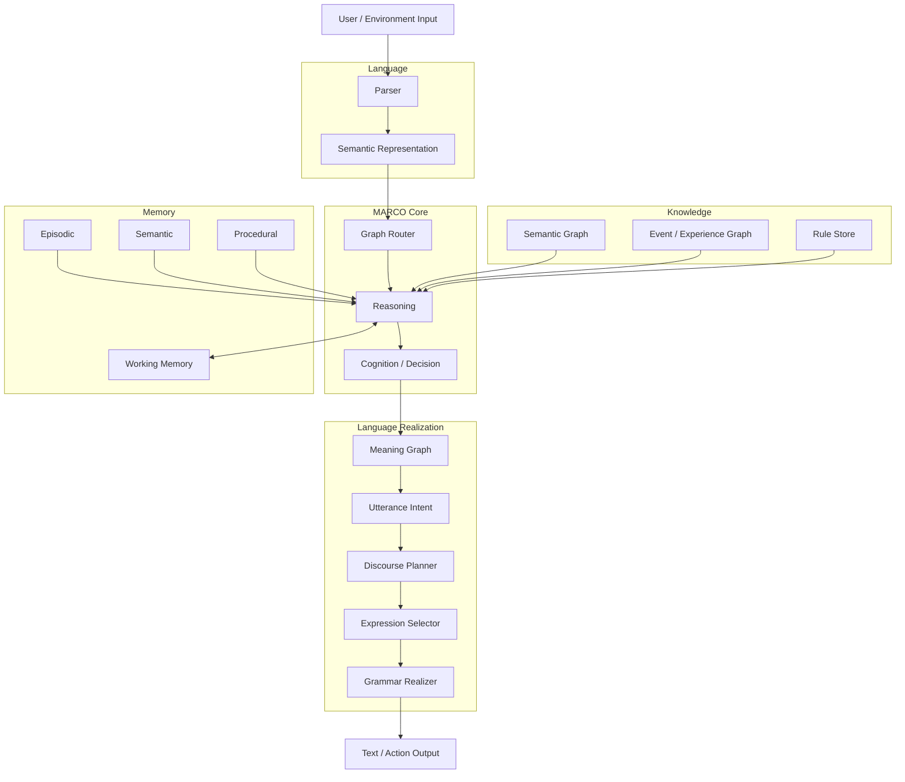

# Marco

**A knowledge-graph engine that selects rather than generates, and says "I don't know"
when the graph has no answer.**

There is no autoregressive loop. One encoder forward per utterance, then the answer is
*chosen* from sentences a human wrote into the graph. Values are *carried* along edges a
human drew. Nothing is invented — which is why every answer leaves an evidence path.

```
> 밥값 나눠야 하는데                      (I need to split the bill)
  정산을 도와드리죠. 얼마 나왔고 몇 분이신지부터 알려 주세요.
> 12만원 나왔어                          (it came to 120,000 won)
  12만원 니까 얼마 나왔는지 안다. 몇 분이서 나누세요?
> 3명이야                                (three of us)
  3명이야 니까 몇 명인지 안다. 그러면 한 사람 40000원 입니다.
> 오늘 서울 날씨 어때                     (what's the weather in Seoul)
  그건 모르겠습니다.                      (I don't know that)
```

`40000` appears nowhere in the graph. Two numbers came from the user's utterances; the
formula `{원 = 총액 / 인원}` was written by a human. The engine only evaluated it.

## Architecture

MARCO decides *what* is true before it decides *how* to say it. By design,
understanding, reasoning and memory work on structures, and only the last stage
turns a language-free meaning into words. Today that last stage is still thin:
answers are authored templates with values filled in (`engine.py` `compose_line`,
the pack's `"{value}{unit}입니다."`). The realizer goal replaces them.



The same pipeline, component by component:



Where each box lives today and the package it moves to. All code is still at the
repository root; the move is planned, measured and gated in the
[structure audit](docs/architecture/structure-audit.md).

| Component | Today | Package | State |
| --- | --- | --- | --- |
| Parser | `relational_semantics.py` (`RelationalParser.parse`), `frame_induction.py`, `input_understanding.py` | `marco/language/` | works for declared Korean; English partial |
| Semantic Representation | `semantic_parser.py` (validated state JSON), facts and events from the parser | `marco/language/` | works |
| Graph Router | `engine.py` graph index, `pick_graph` | `marco/runtime/router.py` | works |
| Reasoning | `engine.py` judge (인정/A/B1/B2/C), `graph_inference.py`, `reasoning_context.py`, `state_engine.py`, `action_runtime.py` | `marco/reasoning/` | works |
| Cognition / Decision | `engine.py` answer ranking and `utterance_plan`, graph activation, `goal_runtime.py` | `marco/cognition/` | partial |
| Semantic Graph | `graphs/*.kg`, concept net, `engine.py` reader | `marco/knowledge/` | works |
| Event / Experience Graph | event ledger in `reasoning_context.py`, `experience_concepts.py` | `marco/reasoning/`, `marco/learning/` | works |
| Rule Store | `axioms/*.json`, pack rules, `rule_learning.py`, `proof_chunking.py` | `axioms/`, `marco/learning/` | works |
| Working Memory | `Session` activation, `explain.py` dialogue memory, ALMA working memory | `marco/cognition/`, `marco/memory/` | partial |
| Episodic / Semantic / Procedural | ALMA state (`alma_runtime.py`), replay ledger, learned action programs | `marco/memory/` | ALMA only |
| Meaning Graph | `transitions` and proofs; `engine.py` `utterance_plan` | `marco/language/realizer/meaning.py` | no shared contract yet |
| Utterance Intent | — | `marco/language/realizer/intent.py` | planned |
| Discourse Planner | `response_composer.py` (content selection only) | `marco/language/realizer/discourse.py` | partial |
| Expression Selector | pack phrasings, `affect_state.py` | `marco/language/realizer/expression.py` | partial |
| Grammar Realizer | `hangul.py` inflection and particles, `engine.py` `compose_line` | `marco/language/realizer/grammar.py` | Korean only |

Dependencies point one way. A package may import its own layer and the ones to its left:

```text
language, perception → storage → knowledge → memory → reasoning → learning → host → cognition → runtime
                                                                        alma, polo, views → mco
```

[Structure audit](docs/architecture/structure-audit.md) ·
[Korean README](docs/ko/README-full.md) · [Graph authoring guide](docs/ko/그래프-저작-프롬프트.md) ·
[Knowledge graph viewer](views/지식그래프.html) · [ALMA 0.1 research loop](docs/ko/alma-0.1.md)

### Python package: `mco`

`mco` is the stable public API over this engine. It loads, runs, inspects,
compiles and benchmarks `.mco` models without importing MARCO's internal
modules. See [docs/mco/README.md](docs/mco/README.md).

```bash
pip install -e .
mco compile . -o MARCO-1.mco --name MARCO-1
mco run MARCO-1.mco "12만원 나왔어" "3명이야"
```

### ALMA 0.1 research loop

`alma_cli.py` is a small, resumable environment that reuses the event and proof
core rather than replacing it.  It keeps personal state outside portable
`.kgpack` knowledge: append-only `SYSTEM`/`COGNITION`/`LIFE` entries, episodic,
semantic and procedural views, goal-cause records, experience-derived
preferences, and capability call history.

```bash
python alma_cli.py --state .nai/alma-state.json --identity demo --turn "민수 구슬은 8개 있다."
python alma_cli.py --state .nai/alma-state.json --identity demo --memory episodic
python alma_cli.py --state .nai/alma-state.json --identity demo --recall procedural --recall-key 베풀
# Natural typed-memory questions use the same durable provenance as --recall.
python alma_cli.py --state .nai/alma-state.json --identity demo --turn "하는 방법: 베풀"
python alma_cli.py --state .nai/alma-state.json --identity demo --mental-holder 지연 --mental-kind belief
python alma_cli.py --state .nai/alma-state.json --identity demo --turn "지연의 믿음은 뭐야?"
python alma_cli.py --state .nai/alma-state.json --identity demo --project-state-at 2
python alma_cli.py --state .nai/alma-state.json --identity demo --search "민수" --search-kinds event,log
python alma_cli.py --state .nai/alma-state.json --identity demo --backup-state .nai/alma-backup.json
# Pack knowledge separately, then run a personal life from the verified pack.
python kgpack.py --pack .nai/knowledge.kgpack --root .
python alma_cli.py --pack .nai/knowledge.kgpack --state .nai/packed-state.json --identity packed-demo --turn "민수 구슬은 8개 있다."
python alma_cli.py --pack .nai/knowledge.kgpack --state .nai/packed-state.json --identity packed-demo --backup-state .nai/packed-backup.json
python alma_cli.py --pack .nai/knowledge.kgpack --state .nai/packed-backup.json --identity packed-demo --turn "지금 민수 구슬은 몇 개야?"
python alma_cli.py --state .nai/alma-state.json --identity demo --cycle-steps cycle.json --step-budget 4
python alma_cli.py --state .nai/alma-environment.json --identity demo --environment bench/alma_local_environment.json --step-budget 1
# Re-run the preceding command with the returned environment ID to resume:
python alma_cli.py --state .nai/alma-environment.json --identity demo --environment bench/alma_local_environment.json --resume-environment environment:ID --step-budget 4
python -m pytest -q tests/test_alma_runtime.py
python bench/alma_integrated_reproduction.py --output alma-integrated-report.json
python bench/alma_integrated_late_error_reproduction.py --output alma-integrated-late-error-report.json
python bench/alma_environment_reproduction.py --output alma-environment-report.json
python bench/alma_learning_lifecycle_reproduction.py --output alma-learning-lifecycle-report.json
python bench/alma_structural_transfer_reproduction.py --output alma-structural-transfer-report.json
python bench/alma_graph_asset_reproduction.py --output alma-graph-asset-report.json
python bench/alma_regression_reproduction.py --output alma-regression-report.json
python bench/alma_full_pytest_reproduction.py --output alma-full-pytest-report.json
python bench/alma_unified_reproduction.py --output alma-unified-report.json
```

The state file is an individual life/history backup and is deliberately not
added to a kgpack export.  Capability declarations persist, while adapters are
host-local and must be registered again after restart; an absent adapter returns
the recorded `adapter_unavailable` failure rather than silently changing state.
Cycle steps are data-defined and checkpointed after each completed operation;
resuming requires the same graph SHA-256.

---

## Measured state

904 graphs in `graphs/` at commit `6195040`. All numbers below are from the repository's
own fixed benchmarks, not estimates. The routing rows were re-measured at `6195040`
(`routing_benchmark.py --답`); latency, start-up and memory were measured when the
repository had 145 graphs and have not been re-measured since.

| | Value | Meaning |
|---|---|---|
| **Out-of-domain rejection** | **24 / 24** | Questions no graph covers are refused |
| Chosen graph answers | 76.1 % | 5,259 of 6,912 held-out phrasings |
| Routes to source graph | 40.6 % | 2,807 of 6,912. Low because overlapping graphs split the credit |
| **Turn latency** | **7.4 ms** | Route + judge + render |
| Cold start | 204 ms | Index 145 graphs from cache |
| **Resident memory** | **68 MB** | `torch` is never imported |
| Dependencies | `numpy` | Character encoder needs nothing else |
| Code | 31,396 lines | 61 root modules; `engine.py` alone is 6,072 |

Reproduce:

```bash
KG_ENCODER=문자 python routing_benchmark.py --답
KG_ENCODER=문자 python engine.py --regress
KG_ENCODER=문자 python engine.py --check
```

---

## Why it cannot hallucinate

Three structural properties, not guardrails.

**1. The answer space is enumerable.** Responses are drawn from `[대사]` templates whose
slots are filled with sentences already present in the graph. There is no decoder, so
there is no sampling step at which an unseen string could appear.

**2. "Irrelevant" and "unknown" are different verdicts.** Collapsing them is the classic
failure mode — a system that says "not relevant" to everything it lacks will confidently
dismiss valid arguments.

| Verdict | Condition | Meaning |
|---|---|---|
| `인정` accept | evidence supports claim | proven |
| `A` ask-back | `A_MIN ≤ conf < OK_MIN` | "did you mean X?" |
| `B1` / `근거없음` | claim matched, no evidence | "what are you basing that on?" |
| `B2` reject | **null-class node scored highest** | *positive* evidence of irrelevance |
| `미지` unknown | nothing scored above `A_MIN` | *absence* of evidence |

The `[무관]` (null class) section is what makes `B2` possible. Without it a graph cannot
distinguish "off topic" from "I have no idea", and the engine refuses to ask back at all
in that case — a document graph with an empty null class will never guess.

**3. Values are transported, never produced.** `{등}` captures a number from the user's
utterance; `{등 <- other_node}` moves it; `{원 = total / people}` evaluates a formula the
author wrote. If any operand is missing, nothing is emitted — filling a gap with zero
would manufacture an answer. Division by zero yields no value rather than infinity. The
expression grammar is a whitelisted AST walk (`+ - * /`, parentheses, node names,
literals); `eval` is never called, because a `.kg` file is human-authored data, not
trusted code.

---

## Request lifecycle

```
                        user utterance
                              │
                ┌─────────────▼─────────────┐
                │  fragment split           │  sentence ends + Korean connective
                │  language detection       │  endings (-하여, -는데, -면서 …)
                └─────────────┬─────────────┘  English → also add a de-framed fragment
                              │
                ┌─────────────▼─────────────┐
                │  ROUTER  (graph index)    │  145 tables of contents, always resident
                │  sparse dot product       │  12.7 MB · 3.7 % non-zero
                │  0.8 – 4 ms               │  graph bodies are NOT opened here
                └─────────────┬─────────────┘
                              │
              below threshold │ above threshold
                    ┌─────────┴─────────┐
                    ▼                   ▼
              ┌──────────┐   ┌──────────────────┐
              │  미지     │   │  graph loader    │  LRU, 2 bodies max
              │ "unknown"│   │  (expands 포함:)  │
              └──────────┘   └────────┬─────────┘
                                      │
                     ┌────────────────▼────────────────┐
                     │            judge()              │
                     │  1. find ALL evidence           │  literal, digit- and
                     │     (concept-network expanded)  │  ending-tolerant
                     │  2. erase evidence, match claim │
                     │  3. compete against null class  │  → B2
                     │  4. read 근거관계 edge           │  when the utterance IS evidence
                     └────────────────┬────────────────┘
                                      │
                     ┌────────────────▼────────────────┐
                     │       session (multi-turn)      │
                     │  · bipartite evidence→requirement
                     │  · capture / carry / compute    │
                     │  · context-narrowed ask-back    │  → A → learn
                     └────────────────┬────────────────┘
                                      │
                     ┌────────────────▼────────────────┐
                     │  render: 대사 · 물음 · 되물음     │
                     │  Korean particle agreement       │  은/는 이/가 을/를 …
                     └────────────────┬────────────────┘
                                      ▼
                            answer + evidence path
```

### The three-tier memory model

This is why 145 graphs run in 68 MB.

| Tier | Size | Residency |
|---|---|---|
| **Index** | 12.7 MB | Always. Does **not** expand `포함:` |
| **Body** | ~0.5 MB each | Only the graph in use — LRU of 2 |
| **File** | 2–4 KB | On disk |

Adding one graph re-encodes that graph alone (+9 ms), because the vector cache is keyed
per graph by a content hash. Deleting one drops it automatically.

---

## The encoder: coverage, not cosine

The default encoder uses **no neural network and no tokenizer** — signed character
n-gram hashing into 4,096 dimensions, with the two sides built asymmetrically so the dot
product measures *containment*:

- **contained side** (index lines, node names): weights L1-normalised by their own mass
- **containing side** (the question): presence only, clipped to ±1 — length does not
  enter the denominator

So the score answers *"what fraction of this index line appears in the question?"* rather
than *"how similar are these two strings?"*.

Cosine was measured and rejected: asking `도메인` alone scored 1.000 but
`엔진은 도메인을 어떻게 다루나` collapsed to 0.211, because the question's own length is
in the denominator and real questions are always longer than node names. Under coverage
the positive/negative medians separate to 0.625 / 0.317.

Three guards keep coverage honest:

- **Short index lines cannot win long questions** (< 8 chars, > 2× length ratio). Without
  it `맞습니다` shares `-습니다` n-grams with `맞붙어 싸웠습니다` at 0.74, and one
  etiquette graph hijacked 224 questions.
- **Short questions are also scored in reverse** (≤ 8 chars). A short question has few
  n-grams and cannot cover a long line; measuring the other direction lifted evidence
  routing from 68.8 % to 87.9 % at zero cost to rejection.
- **Digits are masked on both sides.** `2등을 제쳤다` and `5등을 제쳤다` are the same
  evidence; magnitude is handled separately by numeric conditions.

A neural encoder (`jhgan/ko-sroberta-multitask`) is available and handles unseen
phrasings better, at 550 ms/turn and 860 MB.

---

## Graph format (`.kg`)

```
역할: 정산 도우미                      role
목표: 몫을안다                         goal
임계값: 0.50 / 0.60                    A_MIN / OK_MIN
이름말: 문장                           render node names as sentences
전진관계: 확인함, 이어짐                ← relation NAMES are per-graph
부정관계: 어긋남
근거관계: 확인함

[개념]   concepts — states
몫을안다 {원 = 총액 / 인원}: "한 사람이 얼마 낼지 안다" | "밥값 나눠야 하는데"
총액 {원}:  "전체 금액을 안다"
인원 {명}:  "몇 명인지 안다"

[공리]   axioms — facts needing no evidence
신고기간은5월@국세청: "종합소득세 신고 기간은 5월입니다"

[사례]   instances — actions and evidence
*금액들음: "12만원" | "12만원 나왔어" | "12만원인데"
*인원들음: "3명이야" | "3명입니다" | "세 명이서 먹었어"

[무관]   null class — decoys and small talk; the basis for refusal
_잡담: "점심 뭐 먹지" | "날씨가 좋네요"

[논증]   argument edges ← this is the knowledge
금액들음 -확인함-> 총액
인원들음 -확인함-> 인원
총액 -이어짐-> 몫을안다
인원 -이어짐-> 몫을안다

[개념망] concept network — lexical widening, hyponym -상위-> hypernym
뺐어요 -상위-> 모았어요

[물음]   ask for a missing requirement instead of announcing it
인원: 몇 분이서 나누세요?

[되물음] what to say when unsure
총액: 금액 이야기인가요? 얼마 나왔는지 말씀해 주세요.

[대사]   per-verdict templates
인정: {ev} 니까 {claim}.
결론값: 그러면 한 사람 {값} 입니다.
```

### Relation names are data, not code

The engine knows exactly **three roles**; every graph names them itself. `npc_대장장이.kg`
uses no courtroom vocabulary at all.

| Role | Determines |
|---|---|
| `근거관계` | which instance nodes are **evidence** |
| `전진관계` into the goal | which concepts are **requirements** |
| `전진관계` between concepts | **reachability** — over half of all edges |
| `부정관계` | counters and self-defeat |

Delete every edge from a graph and evidence count drops to 0, requirement count drops to
0, and the session reports a *win* without the user having said anything — there are no
requirements left to fill. **Nodes are labels; edges are the knowledge.**

Requirements are conjunctive, but multiple edges *into one concept* are disjunctive —
each alone suffices. Two facts that must both hold have to be two requirements.

### Sharing knowledge across graphs

`포함:` merges another graph's concepts, argument edges and axioms — never its instances,
which belong to their own case. Relation names are translated by role on import, so a
graph using `충족` can be included by one using `이어짐`. Seven case files share
`legal/법리_형법21조.kg` this way.

`python engine.py --dups` finds knowledge duplicated across graphs, deliberately ignoring
overlap that lives in a null class — that kind is a *boundary*, not redundancy, and
removing it makes neighbouring graphs steal each other's questions.

---

## Learning

The engine learns exactly one thing, and only with human confirmation: **that a phrase
denotes an existing node.**

```
> 녹화 화면                                    (recorded footage)
  혹시 「나갈 길이 막혀 있었습니다」는 말씀입니까?
> 네                                           (yes)
  → graphs/graph.학습.jsonl  {"노드": "현장사진", "말": "녹화 화면"}
```

The interesting part is *when* it asks. Similarity alone never triggers this — an unknown
phrase shares no characters with anything (`녹화 화면` scores 0.098). Instead the session
narrows candidates to **evidence that still reaches an unfilled requirement**, turning ten
candidates into six. Measured over 167 unrecognised utterances: **91 % fall inside that
narrowed set, and 44 % are its top-ranked member.** Inside a small candidate set the
question is no longer "what is this?" but "which of these six is it closest to?" — which
is worth asking aloud.

Learned aliases feed back into the router index (keyed on the learning log's mtime), so a
phrase learned in one conversation routes correctly in the next.

What it does **not** learn: new nodes, new edges, new graphs. Proposal tools
(`--dups`, `--bridges`, `--edges`, `--suggest`) emit candidates only; a human decides.
Choosing edge direction automatically is the point at which a graph would begin asserting
without grounds.

---

## Capability

Measured behaviour, run against the shipped graphs.

| Class | Prompt | Result |
|---|---|---|
| Trap reasoning | Overtake 2nd place in a marathon — what place? | **2nd** |
| Trap reasoning | 60 players take 60 min; how long for 120? | asks for the piece's length (headcount irrelevant) |
| Trap reasoning | Carwash 5 min on foot, 10 by car — drive? | time comparison is irrelevant to washing a car |
| Arithmetic | Split 120,000 among 3 | **40,000 each** |
| Multi-turn | facts given across turns | accumulate to the same answer |
| Learning | unknown phrase → ask-back → "yes" | stored as an alias |
| Refusal | bank balance · today's weather | **"I don't know"** |
| English | split the bill / 120000 won / 3 people | **"Then it is 40000won each."** |

### Position relative to other systems

| | Breadth | Reasoning | Refusal |
|---|---|---|---|
| ELIZA / pattern chatbots | none | none | none |
| Expert systems (MYCIN-era) | narrow | yes | partial |
| Retrieval chatbots | broad | none | weak |
| **Marco** | **narrow (904 graphs)** | **yes** | **strong (24/24)** |
| Modern LLMs | very broad | yes | **weak** |

A precise specialist with a small world. Inside its graphs it computes, resists
traps, and refuses cleanly; outside them it knows nothing. Breadth is the fundamental
gap, and closing it requires humans to draw graphs.

> This table compares system *classes* by what they do; it is not a head-to-head
> benchmark. The measured claims are the 27/27 rejection rate and the trap results above.

---

## Quick start

Python 3.10+.

```bash
pip install numpy                       # character encoder needs nothing else

KG_ENCODER=문자 python engine.py graphs/graph_정산_나눠내기.kg      # chat with one graph
KG_ENCODER=문자 python engine.py --route "밥값 나눠야 하는데"        # route across all graphs
KG_ENCODER=문자 python engine.py --diagnose graphs/graph_순위_추월.kg

KG_ENCODER=문자 python engine.py --check      # self-check
KG_ENCODER=문자 python engine.py --regress    # case regression
KG_ENCODER=문자 python routing_benchmark.py --답
```

Graph-growing tools — all propose, none decide:

```bash
python engine.py --dups      # same knowledge written into several graphs
python engine.py --bridges   # graphs worth linking (magnets filtered by mutual rank)
python engine.py --edges     # relation candidates from source text
python engine.py --suggest   # node candidates from source text
```

For the neural encoder: `pip install sentence-transformers` and leave `KG_ENCODER` unset.

---

## Layout

Code identifiers — file, function and variable names — are English. The knowledge
is Korean: `.kg` section headers, node names, verdicts and reply templates are the
product, not the implementation, and they stay as authored.

Files still sit at the repository root. Each belongs to one subsystem; the list below
is that assignment (audit A1). `engine.py` is split across several subsystems — its
20 parts and their line ranges are in audit A3.

```text
language          hangul · encoder · language_components · input_understanding
                  relational_semantics (parse) · frame_induction · semantic_parser
                  numeral_semantics · expression_graph · verbal_expression
                  passage_components · passage_classifier
  realizer        response_composer · affect_state · output_contracts   (+ engine: compose_line)
perception        document_visual · document_vlm · document_objects · document_pose
storage           kgpack · kgbin · conversation_store · pack_model
knowledge         build · document_kg · dict_extract · purpose_graph · web_learn · local_definitions
                  (+ engine: .kg format, graph structure, node and evidence matching)
reasoning         graph_inference · reasoning_context · state_engine · action_runtime
                  (+ engine: judge; relational_semantics: answer)
learning          experience_concepts · rule_learning · proof_chunking · expression_learning
                  semantic_feedback · self_authoring   (+ engine: authoring suggestions)
host              act · goal_runtime (approval, tool execution)
cognition         goal_runtime (planning)   (+ engine: graph activation, turn meaning)
runtime           engine (entry, router, sessions, CLI) · explain · graph_dialogue · nai
                  views/kgpack_ui (app state)
alma              alma_runtime · alma_environment · alma_cli
mco               mco/   public API over MARCO (branch mco-package)

bench             routing_benchmark · yardstick · intelligence_check · bench/
tools             alias_diag · cache_tool · self_learning · tools/import_graph.py · tools/
experiments       vision · codegen · autocoder · universal_agent

data              graphs/*.kg (904) · legal/*.kg · cases/ · styles/ · axioms/ · data/표지/
docs              docs/architecture/ (structure) · docs/ko/ (design records, Korean)
tests             tests/ (pytest)
```

Before adding a file, name the subsystem that owns it. The import rule above is
checked by `python tools/import_graph.py --targets docs/architecture/target-map.json`.

---

## Design principles

**Never invent.** Answers are selected from authored sentences; values are transported
from the user's own utterance; formulas, relations and questions are written by humans.

**Separate "unknown" from "irrelevant."** Merging them makes the system lie about valid
arguments it simply does not cover.

**Machines propose, humans confirm.** Every growth tool emits candidates only.

**Swap domains without touching the engine.** Relation vocabulary, phrasing, and
follow-up questions all live in graphs and data files.

**Stay light.** 68 MB, 7 ms per turn, no `torch`. This constraint is not negotiable.

---

## Limits

- **Narrow knowledge.** 904 graphs is the whole world. Growth is human-paced.
- **Unseen phrasings.** 40.6 % route to their source graph; much of the remainder is
  defensible overlap between related graphs, but genuine misses remain.
- **English is half-supported.** Questions containing English terms reach Korean graphs,
  but answers come back in Korean. Answering in English requires an English graph for
  that domain.
- **No structural learning.** It learns aliases, not nodes or edges.
- **Korean numerals are not parsed.** `세 명` yields no value — it does not guess.

### Paths measured and abandoned

- **Dictionary synonyms** (12,206 pairs extracted from the Korean standard dictionary) —
  zero improvement. Mostly nouns, senses not disambiguated.
- **IDF weighting** — +0.9 pp at matched rejection rate; not worth recalibrating for.
- **Shared Hanja as a synonym signal** — 5–10 % precision.
- **Word substitution as translation** — catches `smoke 발견했어요` but not
  `I found smoke`. The syntactic frame stays Korean.
